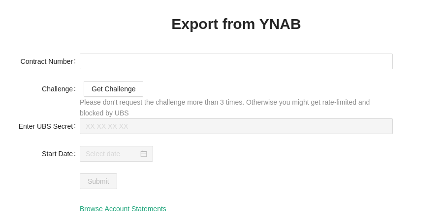

# Graphical UBS 2 YNAB Exporter

> Export your UBS Switzerland bank transactions for import in YNAB

This tool automatically tries to export all transactions from the available bank and credit card accounts into a.csv, which can be easily imported into YNAB.
The UBS Access Card is required for export to access the UBS account.
The API and the csvExport implementations are fully copied from [https://github.com/Che4ter/UBStoYNAB](https://github.com/Che4ter/UBStoYNAB)

This projects adds a React frontend (based on ant design), as well as a goland echo api. Essentially this project just adds a simple web-based frontend as extension to the Che4ter's command line application.
This is a quick and dirty implementation: no error handling, no tests, ... so far.
Both the frontend and backend are dockerized and can be easily deployed using `docker-compose`.



# Usage

```bash
git clone https://github.com/divadvo/UBS2YNAB
cd UBS2YNAB
```

Copy `docker-compose.example.yml` to `docker-compose.yml` and change the `CONTRACT_NUMBER` variable to your UBS contract number.

```bash
docker-compose build
docker-compose up
```

Access the frontend at [localhost:5002](http://localhost:5002)

```
// to stop
docker-compose down
```

## Thanks

This project is based upon [https://github.com/Che4ter/UBStoYNAB](https://github.com/Che4ter/UBStoYNA])

I just created the fronend and api endpoints for Che4ter's command line application.

## Meta

divadvo – [Github/divadvo](https://github.com/divadvo)

[https://github.com/divadvo/UBS2YNAB](https://github.com/divadvo/UBS2YNAB)
